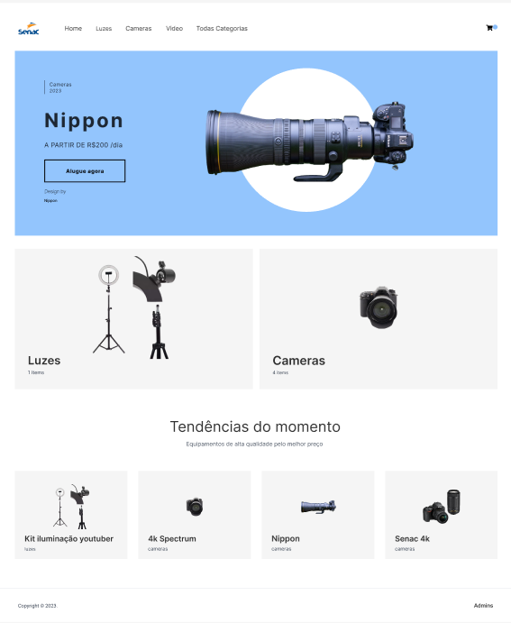

## PI - ADS Next

PI - ADS Next provides a way to quickly get up and running with a fully configurable ECommerce site using Next.js.



### Getting started

1. Clone the project

```sh
$ git clone https://github.com/aton-py/pti-senac.git
```

2. Install the dependencies:

```sh
$ yarn

# or

$ npm install
```

3. Run the project

```sh
$ npm run dev

# or to build

$ npm run build
```

## Deploy to Vercel

Use the [Vercel CLI](https://vercel.com/download)

```sh
vercel
```

## Deploy to AWS

```sh
npx serverless
```

## About the project

### Tailwind

This project is styled using Tailwind. To learn more how this works, check out the Tailwind documentation [here](https://tailwindcss.com/docs).

